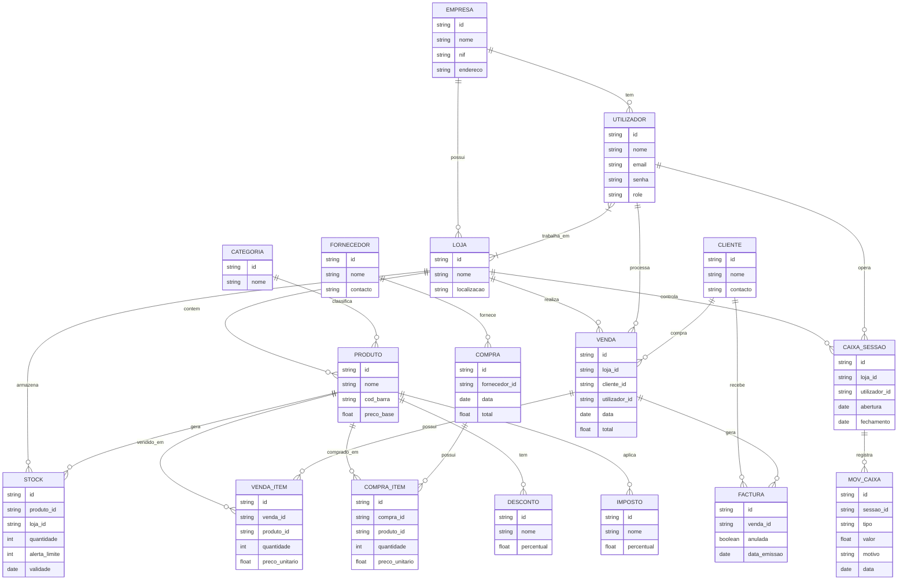
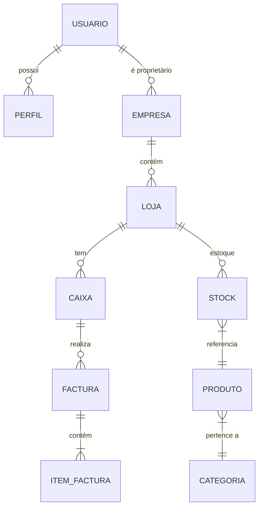

```mermaid
erDiagram

    EMPRESA ||--o{ LOJA : possui
    EMPRESA ||--o{ UTILIZADOR : tem

    LOJA ||--o{ PRODUTO : contem
    LOJA ||--o{ VENDA : realiza
    LOJA ||--o{ STOCK : armazena
    LOJA ||--o{ CAIXA_SESSAO : controla

    UTILIZADOR ||--o{ CAIXA_SESSAO : opera
    UTILIZADOR ||--o{ VENDA : processa
    UTILIZADOR }|--|{ LOJA : trabalha_em

    CATEGORIA ||--o{ PRODUTO : classifica
    PRODUTO ||--o{ STOCK : gera
    PRODUTO ||--o{ VENDA_ITEM : vendido_em
    PRODUTO ||--o{ COMPRA_ITEM : comprado_em

    CLIENTE ||--o{ VENDA : compra
    CLIENTE ||--o{ FACTURA : recebe

    FORNECEDOR ||--o{ COMPRA : fornece

    COMPRA ||--o{ COMPRA_ITEM : possui
    VENDA ||--o{ VENDA_ITEM : possui
    VENDA ||--o{ FACTURA : gera
    PRODUTO ||--o{ DESCONTO : tem
    PRODUTO ||--o{ IMPOSTO : aplica

    CAIXA_SESSAO ||--o{ MOV_CAIXA : registra

    EMPRESA {
        string id
        string nome
        string nif
        string endereco
    }

    LOJA {
        string id
        string nome
        string localizacao
    }

    UTILIZADOR {
        string id
        string nome
        string email
        string senha
        string role
    }

    CATEGORIA {
        string id
        string nome
    }

    PRODUTO {
        string id
        string nome
        string cod_barra
        float preco_base
    }

    STOCK {
        string id
        string produto_id
        string loja_id
        int quantidade
        int alerta_limite
        date validade
    }

    FORNECEDOR {
        string id
        string nome
        string contacto
    }

    COMPRA {
        string id
        string fornecedor_id
        date data
        float total
    }

    COMPRA_ITEM {
        string id
        string compra_id
        string produto_id
        int quantidade
        float preco_unitario
    }

    CLIENTE {
        string id
        string nome
        string contacto
    }

    VENDA {
        string id
        string loja_id
        string cliente_id
        string utilizador_id
        date data
        float total
    }

    VENDA_ITEM {
        string id
        string venda_id
        string produto_id
        int quantidade
        float preco_unitario
    }

    FACTURA {
        string id
        string venda_id
        boolean anulada
        date data_emissao
    }

    IMPOSTO {
        string id
        string nome
        float percentual
    }

    DESCONTO {
        string id
        string nome
        float percentual
    }

    CAIXA_SESSAO {
        string id
        string loja_id
        string utilizador_id
        date abertura
        date fechamento
    }

    MOV_CAIXA {
        string id
        string sessao_id
        string tipo
        float valor
        string motivo
        date data
    }

```

```mermaid
    erDiagram
    USUARIO ||--o{ PERFIL : "possui"
    USUARIO ||--o{ EMPRESA : "é proprietário"
    EMPRESA ||--o{ LOJA : "contém"
    LOJA ||--o{ CAIXA : "tem"
    CAIXA ||--o{ FACTURA : "realiza"
    FACTURA ||--|{ ITEM_FACTURA : "contém"
    LOJA ||--o{ STOCK : "estoque"
    STOCK }|--|| PRODUTO : "referencia"
    PRODUTO }|--|| CATEGORIA : "pertence a"
```
