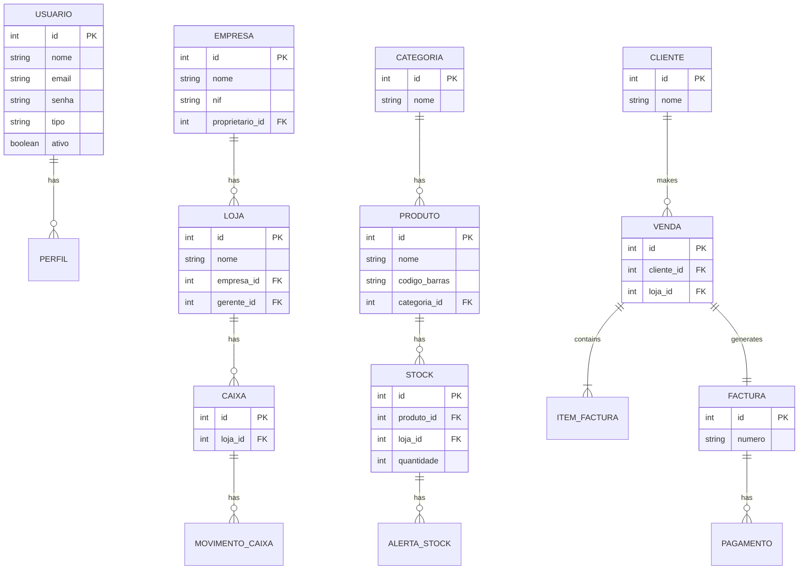
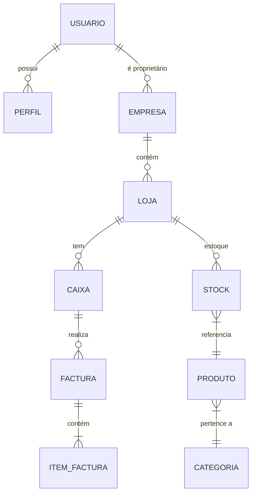

```mermaid
erDiagram
    USUARIO ||--o{ PERFIL : has
    USUARIO {
        int id PK
        string nome
        string email
        string senha
        string tipo
        boolean ativo
    }
    
    EMPRESA ||--o{ LOJA : has
    EMPRESA {
        int id PK
        string nome
        string nif
        int proprietario_id FK
    }
    
    LOJA ||--o{ CAIXA : has
    LOJA {
        int id PK
        string nome
        int empresa_id FK
        int gerente_id FK
    }
    
    CATEGORIA ||--o{ PRODUTO : has
    CATEGORIA {
        int id PK
        string nome
    }
    
    PRODUTO ||--o{ STOCK : has
    PRODUTO {
        int id PK
        string nome
        string codigo_barras
        int categoria_id FK
    }
    
    STOCK ||--o{ ALERTA_STOCK : has
    STOCK {
        int id PK
        int produto_id FK
        int loja_id FK
        int quantidade
    }
    
    CLIENTE ||--o{ VENDA : makes
    CLIENTE {
        int id PK
        string nome
    }
    
    VENDA ||--|{ ITEM_FACTURA : contains
    VENDA ||--|| FACTURA : generates
    VENDA {
        int id PK
        int cliente_id FK
        int loja_id FK
    }
    
    FACTURA ||--o{ PAGAMENTO : has
    FACTURA {
        int id PK
        string numero
    }
    
    CAIXA ||--o{ MOVIMENTO_CAIXA : has
    CAIXA {
        int id PK
        int loja_id FK
    }
```

```mermaid
    erDiagram
    USUARIO ||--o{ PERFIL : "possui"
    USUARIO ||--o{ EMPRESA : "é proprietário"
    EMPRESA ||--o{ LOJA : "contém"
    LOJA ||--o{ CAIXA : "tem"
    CAIXA ||--o{ FACTURA : "realiza"
    FACTURA ||--|{ ITEM_FACTURA : "contém"
    LOJA ||--o{ STOCK : "estoque"
    STOCK }|--|| PRODUTO : "referencia"
    PRODUTO }|--|| CATEGORIA : "pertence a"
```