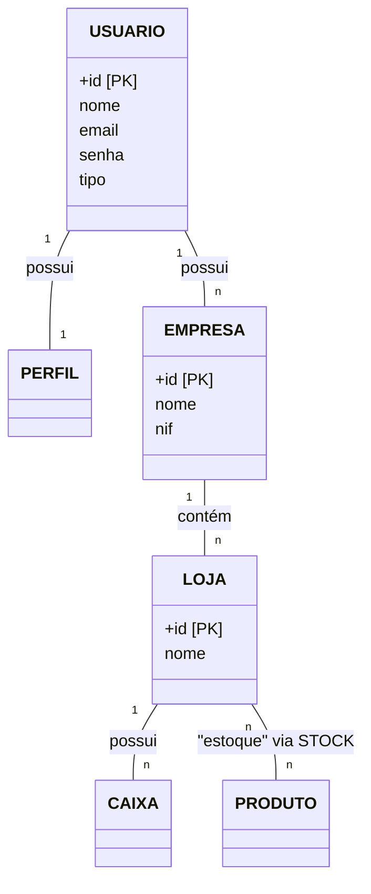

```mermaid
classDiagram
    class USUARIO {
        +id [PK]
        nome
        email
        senha
        tipo
    }
    
    USUARIO "1" -- "1" PERFIL : possui
    USUARIO "1" -- "n" EMPRESA : possui
    
    class EMPRESA {
        +id [PK]
        nome
        nif
    }
    
    EMPRESA "1" -- "n" LOJA : contém
    
    class LOJA {
        +id [PK]
        nome
    }
    
    LOJA "1" -- "n" CAIXA : possui
    LOJA "n" -- "n" PRODUTO : "estoque" via STOCK
```